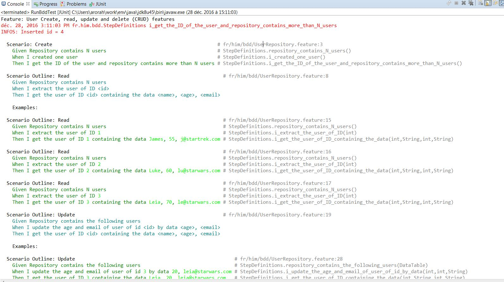

# BddCucumber
A small java project to work with behaviour driven development using Cucumber. It exposes CRUD features for User entity domain.

## Tech env
    - Java8
    - BDD
    - Junit
    - Cucumber
    - Gherkin

## How to run

To run the scenarios defined in `UserRepository.feature` just run the class `RunBddTest` as junit test.

## Output

 

**HTML output report**

[Web report](/target/cucumber/user.html/index.html) 